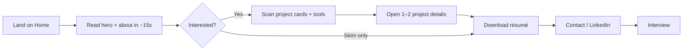

# Personal website planning
_Exported on 7/21/2026 at 20:03:58 EDT from Cursor (3.7.12)_

---

**User**

Act as an expert Web Architect, UX Strategist, and Senior Technical Lead. 

Your task is to collaborate with me to plan a high-impact personal website. Before jumping into code or final recommendations, guide me through a structured planning process across the following four phases:

---

### Phase 1: Strategy & Brand Positioning
1. Purpose & Goals: Ask me targeted questions to clarify the primary objective (e.g., portfolio/job hunting, personal brand/blogging, freelancing, or project showcase).
2. Audience Identification: Help me define my target audience (e.g., tech recruiters, potential clients, engineering managers, or general readers).
3. Value Proposition: Help me draft a concise hero section statement (1–2 sentences) that clearly communicates who I am and what I do.

---

### Phase 2: Content Architecture & Sitemap
1. Core Pages & Sections: Outline a logical sitemap (e.g., Home, About, Projects, Writing/Blog, Contact) based on my goals.
2. Content Breakdown: Detail the essential content blocks required for each section (e.g., Project Cards with tech stack tags, interactive demos, metric-backed impact statements, resume download, contact options).
3. User Journeys: Map out the ideal path a primary visitor (e.g., a recruiter or client) should take from arrival to call-to-action (CTA).

---

### Phase 3: Tech Stack & Architecture
Recommend an optimal tech stack tailored to my background and requirements. Provide 2–3 option tiers (e.g., Low Overhead / Static vs. Modern Full-Stack) considering:
* Framework / SSG (e.g., Next.js, Astro, Remix, React)
* Styling (e.g., Tailwind CSS, CSS Modules, Shadcn/ui)
* Content Management (e.g., MDX, Headless CMS, or local Markdown)
* Hosting & Deployment (e.g., Vercel, Netlify, Cloudflare Pages)
* Dynamic Capabilities (e.g., contact form handling, analytics, SEO optimization)

---

### Phase 4: Implementation Roadmap
Break down the build process into actionable, sequential steps:
1. Setup & Boilerplate
2. Core Components & Layout
3. Content Integration
4. Polish, Accessibility (a11y), and Performance Optimization
5. Launch Checklist (SEO tags, open graph metadata, custom domain, analytics)

---

### Instructions for Execution:
* Do not generate all four phases at once. 
* Start by asking me Phase 1 questions to gather necessary context about my goals, background, and target audience. 
* Wait for my response before moving on to subsequent phases.

---

**Cursor**

# Phase 1: Strategy & Brand Positioning

We’ll lock purpose, audience, and voice before sitemap or stack. Answer what you can; short bullets are fine.

---

### 1. Purpose & Goals

1. **Primary job of the site** (pick one, or rank top 2):  
   job hunting / portfolio · freelance / client work · personal brand / writing · project showcase · something else?

2. **What should a first-time visitor do within ~60 seconds?**  
   (e.g. book a call, email you, download résumé, view a flagship project, subscribe, hire you)

3. **Timeline & ambition**: quick one-pager, or a living site you’ll grow (blog, case studies, etc.)?

4. **Success in 3–6 months** looks like what?  
   (e.g. X interviews, Y inbound leads, Z newsletter signups — even rough numbers help)

---

### 2. Audience Identification

5. **Who is the primary visitor?**  
   recruiters · hiring managers / eng managers · startup founders · agency/clients · peers / community · general readers

6. **Secondary audience?** (optional)

7. What do they care about most when evaluating you?  
   (e.g. shipping speed, system design, product sense, design taste, domain expertise, leadership)

8. Any **industries or roles** you’re targeting (or explicitly avoiding)?

---

### 3. You & Differentiation (feeds the hero)

9. **One-line identity today**: role + specialty  
   (e.g. “Full-stack engineer who ships AI products end-to-end”)

10. **Proof points** you’d lead with (2–4): companies, products, metrics, open source, Flip, etc.

11. **Tone**: formal / crisp-professional · warm-approachable · bold-opinionated · playful · minimal-technical

12. **Constraints**: must-haves (blog, dark mode, bilingual…) and must-nots (no blog, no photos, no contact form…)

13. **Name / URL** if you already have them (or preferences)

---

Reply with numbered answers (1–13). After that I’ll draft a **hero value proposition** with 2–3 options for you to pick/edit, then we move to Phase 2.

---

**User**

job hunting portfolio, read a summary about me, and a list of projects, each project link describes the tools of the project, up to date resume, will grow the site over time, success is interviews, primary visitor is anyone looking to hire me, fill in personal details for now to be updated later, with placeholder picture and content.

---

**Cursor**

# Phase 1 — Locked (with placeholders)

**Site job:** Job-hunting portfolio that grows over time.  
**Primary CTA:** Get an interview (via contact / résumé).  
**Core content:** About summary → project list (tools per project) → current résumé.  
**Audience:** Anyone evaluating you for hire (recruiters, hiring managers, founders).  
**Content mode:** Placeholder bio, photo, and project copy for now; swap in real details later.

---

### Hero value proposition — pick one (or mix)

**Option A — Clear & hireable**  
> I’m [Your Name], a software engineer who ships polished product experiences end-to-end. Here’s a short summary of my work, selected projects, and an up-to-date résumé.

**Option B — Outcome-focused**  
> I build web products from idea to launch — UI, APIs, and the systems behind them. Explore selected projects and download my résumé if you’re hiring.

**Option C — Concise (recommended for a first viewport)**  
> [Your Name] — Software Engineer. Product-minded builder. Projects, tools, and résumé below.

Suggested placeholder identity until you replace it:

| Field | Placeholder |
|--------|-------------|
| Name | Frederick Stoney |
| Title | Software Engineer |
| One-liner | Full-stack engineer focused on shipping web products people actually use |
| Photo | Neutral headshot placeholder |
| Location / availability | Open to opportunities · Remote / [City TBD] |

---

### Phase 1 decisions to confirm

Reply with:

1. **Hero option:** A / B / C / or your rewrite  
2. **Name & title** to use as placeholders (ok to keep Frederick Stoney / Software Engineer)  
3. **Ready for Phase 2?** (sitemap, content blocks, recruiter journey)

Once you confirm, I’ll move to Phase 2 only — content architecture and sitemap for this portfolio.

---

**User**

option c , ready for phase 2

---

**Cursor**

# Phase 2: Content Architecture & Sitemap

Hero locked as **Option C**:  
*[Name] — Software Engineer. Product-minded builder. Projects, tools, and résumé below.*

---

## 1. Core sitemap (growable, not bloated)

For job hunting + future growth, keep the first ship **tight**:

| Route | Purpose | Ship now? |
|-------|---------|-----------|
| `/` (Home) | Hero + about summary + featured projects + CTA | Yes |
| `/projects` | Full project list | Yes (or fold into Home if ≤4 projects) |
| `/projects/[slug]` | Project detail: problem, approach, tools, outcome | Yes |
| `/about` | Longer bio, skills, interests (optional if Home has enough) | Later / light |
| `/resume` | Dedicated résumé page + PDF download | Yes (or Home CTA only) |
| `/contact` | How to reach you | Yes (can be a Home section) |
| `/writing` or `/blog` | Thought leadership | Later (stub nav optional) |

**Recommended v1 structure (simple, high-signal):**

```
Home
├── Hero (Option C)
├── About (short summary)
├── Selected Projects (cards → detail pages)
├── Résumé (preview + download)
└── Contact / Hire me

Projects (index) — optional if Home lists all
Project detail — one page per project
```

Nav: **Home · Projects · Résumé · Contact** (+ Writing later).

---

## 2. Content blocks by section

### Home — Hero
- Name + title (Option C)
- Availability line: e.g. *Open to opportunities*
- Primary CTA: **Download résumé** or **Get in touch**
- Secondary CTA: **View projects**
- Placeholder headshot

### Home — About (summary)
- 2–4 sentences: who you are, what you build, what you’re looking for
- Optional: 4–6 skill chips (e.g. TypeScript, SvelteKit, React, Node, Postgres, Stripe)
- Placeholder copy OK

### Projects — cards (list)
Each card needs:
- Title + one-line outcome
- Thumbnail / placeholder image
- **Tech stack tags** (tools)
- Link → detail page
- Optional: role (Solo / Lead / Contributor), year

### Project detail (`/projects/[slug]`)
Fixed template so you can fill later:
1. **Overview** — what it is  
2. **Problem** — why it existed  
3. **What I built** — your contribution  
4. **Tools** — stack with short “why this tool” if useful  
5. **Impact** — metrics or qualitative result (placeholder fine)  
6. **Links** — live demo / GitHub / case study  
7. **Next** — back to projects + contact CTA

### Résumé
- Embedded preview (PDF iframe or image) **or** concise HTML summary mirroring the PDF  
- **Download PDF** button (always current file)  
- Last-updated date  
- Soft CTA: *Prefer email? → Contact*

### Contact
- Email (mailto)  
- LinkedIn / GitHub  
- Optional: short form (name, email, message) — Phase 3 will cover how  
- One line: response expectation (*Usually within 2–3 days*)

---

## 3. Primary user journey (hire → interview)

**Visitor:** recruiter / hiring manager / founder evaluating you.



**Ideal path in words:**
1. Land → understand role + positioning in one glance (Option C).  
2. Skim About → fit check (stack, domain, seniority vibe).  
3. Scan projects → credibility via tools + outcomes.  
4. Open 1–2 details → depth without a long About page.  
5. Grab résumé → share internally / ATS.  
6. Contact → conversation → **interview** (your success metric).

**Design implication:** Résumé + Contact must be visible from Home (nav + in-page CTAs), not buried.

---

## Phase 2 decisions (reply with choices)

1. **Scope of v1:**  
   - **A)** Single-page Home (About + Projects + Résumé + Contact) + project detail pages  
   - **B)** Multi-page: Home, Projects index, Résumé, Contact  

2. **Project count for launch:** ~3 / ~5 / “as many as I have with placeholders”?  

3. **Résumé on Home:** preview section + download, or download button only?  

4. **Contact:** email + social only, or also a form?  

5. **Nav:** include a greyed “Writing” stub for later growth, or hide until ready?

Once you answer, I’ll proceed to **Phase 3: Tech Stack & Architecture** (2–3 tiers tailored to this plan).

